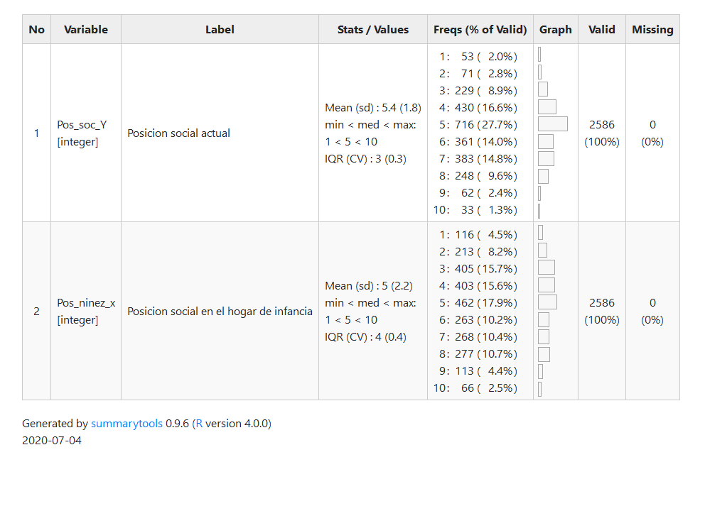
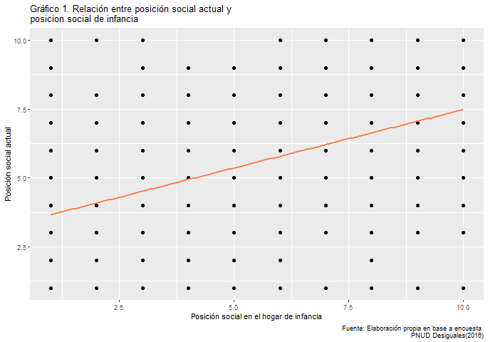
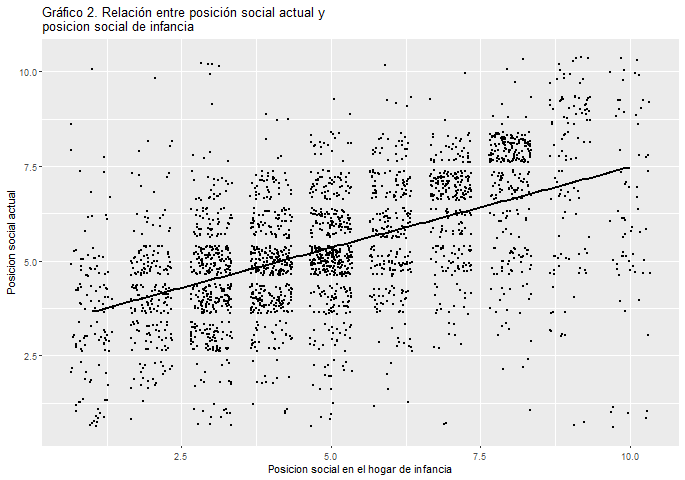
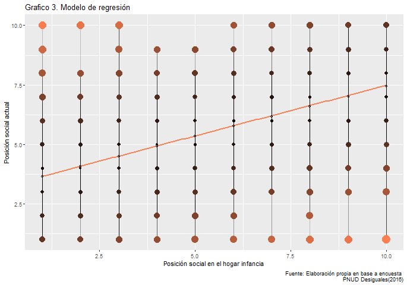

```{r setup, include=FALSE}
knitr::opts_chunk$set(cache = TRUE, warning = FALSE,
                      message = FALSE)
Sys.setlocale("LC_ALL","ES_ES.UTF-8")

```

##### *__Integrantes__: Carlos Arriagada González, Catalina Vidal Lloncon*

##### *__Universidad de Chile__*

##### *__Curso__: Ciencia Social Abierta*

##### *__Profesor__: Juan Carlos Castillo*  


# **Movilidad social en Chile** 

<div style="text-align: justify">

## Resumen

La desigualdad se puede entender a través de diversos factores, entre ellos pueden encontrarse los ingresos, la segregación espacial, los niveles de educación, el campo laboral, entre muchos otros. Uno de los fenómenos que se ve influido por la desigualdad es la movilidad social o movilidad intergeneracional. 
Chile es un ejemplo de país donde la movilidad social es reducida, lo que quiere decir que la posición social o socioeconómica de los padres influye en la posición de sus hijos en el futuro. De modo que, se han perpetuado las desigualdades dentro de la sociedad, y uno de los principales factores de ello, es la distribución desigual de los recursos y riquezas. Sin embargo, esto no quiere decir que a medida que disminuya la pobreza disminuirá también la desigualdad, pues en Chile desde hace algunas décadas ha disminuido la pobreza, pero los índices de desigualdad siguen siendo altos. 
Por lo anterior, es interesante saber y demostrar si efectivamente existe relación entre la posición social durante la infancia de una persona y la posición social actual de la misma, con otras palabras, si se puede predecir la posición social actual de una persona en base a su posición social en el hogar de infancia. Los resultados dan cuenta de que efectivamente existe una relación positiva entre ambas variables y que el modelo de regresión explica en un 28% la variabilidad de los datos.

<div/>

## Antecedentes

La caracterización de la desigualdad ha comprendido extensos estudios en el campo de la sociología, esto debido a que es un fenómeno que puede incorporar diversas y múltiples dimensiones, entre ellas, la estratificación social que es un aspecto fundamental. Sin embargo, generalmente se ha tratado de acuerdo con los ingresos de los hogares, que dan paso a variados coeficientes que miden la desigualdad en un país o sector. De esta manera, el aspecto más subjetivo de la desigualdad se ha visto descuidado y con ello el componente movilizador asociado a pertenecer a algún estatus o clase social [@acastilloTODOSSOMOSCLASE2013]. 
En particular, los estudios de Latinoamérica han progresado más tardíamente, en comparación a los países desarrollados, sobre la movilidad intergeneracional [@ajimenezMovilidadIntergeneracionalIngreso2018], que puede entenderse como la transmisión de la situación social de padres a hijos, y que “puede ser explicada a partir de propiedades personalmente adquiridas (por ejemplo, educación), o por factores de pertenencia social a un contexto sociocultural o familiar determinado” [@acastilloTODOSSOMOSCLASE2013, pp.160]. De este modo, la movilidad social se relaciona directamente con la distribución de oportunidades que permiten a las personas integrarse a la sociedad, por lo cual la educación, y con ello, los ingresos, son pilares fundamentales para alcanzar una mayor movilidad social, no obstante, mientras existan los mismos patrones de desigualdad social existirá una transferencia generacional y permanencia de las desigualdades a través del tiempo [@apnudDesigualesOrigenesCambios2017].
En consecuencia, estudios como el de @acastilloTODOSSOMOSCLASE2013, han concluido que existe una tendencia hacia la media del estatus subjetivo, es decir, que los sujetos tienden a optar por niveles de estatus social, no demasiado altos o bajos, lo que se produce por la sobreestimación del estatus en personas de niveles sociales más bajos y subestimación del estatus en personas de niveles sociales superiores, por otro lado, que el estatus subjetivo posee un alto poder predictivo del estatus subjetivo actual, o sea que no existe gran movilidad intergeneracional. En palabras más simples, la sociedad en Chile tiende a pensarse a si misma como “clase media”, aunque no lo sea.  Por otro lado, cuando las personas piensan en la situación de generaciones anteriores respecto a la de ellas, en general observan progresos, especialmente porque tienen en cuenta la miseria que caracterizaba a Chile hace décadas atrás [@apnudDesigualesOrigenesCambios2017].

## Metodología 

### **1. Descripción de la base de datos**
```{r, echo=TRUE, eval=FALSE}
#  Cargar librerias
pacman::p_load(dplyr,stargazer, car, sjlabelled, summarytools, citr, sjmisc, sjPlot, ggplot2, webshot)
webshot::install_phantomjs( force = T)
options(scipen=999)
```

```{r}
#  Abrir base de datos 
load(file = "input/data/proc/proc_Desiguales.RData")
View(proc_Desiguales)
```


La [“Encuesta desigualdades económicas y sociales”](https://static1.squarespace.com/static/591a16f0b3db2b9357e5d065/t/5963f4e56b8f5b7f7b9291da/1499722984814/PNUD_DES2016_Cuestionario.pdf) comprende una base de datos con 2.613 casos y 329 variables, por medio de las cuales pretenden evaluar la desigualdad socioeconómica en Chile. Los datos fueron recolectados mediante encuestas individuales y presenciales, en los hogares, a hombres y mujeres mayores de 18 años residentes en zonas urbanas y rurales de 15 regiones del país durante el año 2016. A partir de esta base de datos se construyó el libro [“DESIGUALES, Orígenes, cambios y desafíos de la brecha social en Chile”](https://static1.squarespace.com/static/591a16f0b3db2b9357e5d065/t/5963de1803596e096b39d652/1499717169220/DESIGUALES_reimp.pdf) durante 2017, en el cual se abordan diversas dimensiones de la desigualdad, tanto de Chile como de otros países. 

### **2. Variables**

Para llevar a cabo este trabajo se creó una nueva base de datos considerando dos variables de la encuesta nombrada anteriormente, ambas consideran como respuesta una escala de Likert de 10 valores, donde 1 corresponde al “Nivel más bajo” y 10 “Nivel más alto”, por consiguiente, a partir de la pregunta: 

“En Chile las personas tienen distintos recursos económicos. Tomado en cuenta a todas las personas de este país, y pensando en una escala en que 1 representa la posición de los que tienen menos recursos y 10 la posición de los que tienen más recursos, ¿dónde se ubicaría usted en esta escala?”
Se escogieron las siguientes variables:

 1.	[`Pos_soc_Y`] Posición social actual, como la variable dependiente.
 2.	[`Pos_ninez_x`] Posición social en el hogar de infancia, como la variable independiente.
 

En la [Tabla 1](#tabla-1.-estadísticos-descriptivos-de-las-variables) se muestra una descripción de las variables, se puede ver que en el caso de la variable posición actual, la mayoría de las personas en promedio optan por la opción 5, muy similar a lo que pasa con la variable independiente, pues tienen una media de 5.4 y 5 respectivamente. Por el contrario, los niveles extremos concentran la menor cantidad de observaciones, en el caso de la variable dependiente un 4.8% del total en el nivel mas bajo (1 y 2) y un 3.7% del total en el nivel más alto (9 y 10). Por otro lado, la variable independiente concentra un 80.5% del total de observaciones entre los valores 3 y 8. Igualmente, ambas variables tienen una dispersión similar en torno a la media, con desviaciones estándar de 1.8 (Posición actual) y 2.2 (Posición infancia). Esto puede explicarse porque los límites entre grupos socioeconómicos no son rígidos y pueden depender tanto de factores económicos como culturales, por lo que existe una tendencia de la sociedad de sentirse “clase media” [@apnudDesigualesOrigenesCambios2017].

#### Tabla 1. Estadísticos descriptivos de las variables

```{r, echo=TRUE, eval=FALSE}
#  Generar tabla de estadisticos
dfSummary(proc_Desiguales, plain.ascii = FALSE)
```




## Análisis

### 1. Análisis descriptivo

El [Gráfico 1](#gráfico-1) muestra la relación entre las variables posición social actual y posición social en la infancia, los puntos representan las observaciones, no obstante, esto se esclarece más con el [Gráfico 2](#gráfico-2), gracias al cual se puede ver que la distribución de los casos se concentra en torno a los valores medios (entre 3 y 7) en ambas variables. 
También, se podría decir que existe una asociación positiva con fuerza moderada entre las variables, esta última “determinada por lo cerca que quedan los puntos de una determinada curva imaginaria” [@amooreAnalisisRelaciones2010, pp.106] lo cual se puede corroborar con la [Tabla 2](#tabla-2.-matriz-de-correlación-entre-la-variable-posición-social-actual-y-posición-social-en-la-infancia), en donde se señala la correlación entre las variables, correspondiente a 0.53. De manera que a medida que aumenta la posición social de la infancia, aumenta también la posición social actual o viceversa.


#### Gráfico 1

```{r echo=TRUE, eval=FALSE}
#  Grafico con recta incluida
Grafico3=ggplot(proc_Desiguales, aes(x=Pos_ninez_x, y=Pos_soc_Y)) +
  geom_point(colour = "black", size = 2) +
  geom_smooth(method=lm, se=FALSE, colour = "coral") + labs(title = "Gráfico 1. Relación entre posición social actual y
posicion social de infancia", caption = "Fuente: Elaboración propia en base a encuesta 
                                               PNUD Desiguales(2016)", y = "Posición social actual",
                                                            x ="Posición social en el hogar de infancia")

Grafico3

```



#### Gráfico 2 

```{r echo=TRUE, eval=FALSE}
#  Grafico de nube
Grafico2 <- plot_scatter(proc_Desiguales, Pos_ninez_x, Pos_soc_Y, dot.size =0.5, colors = "black", , title ="Gráfico 2. Relación entre posición social actual y posicion social de infancia", jitter = .35, fit.line = lm)

Grafico2
```



#### Tabla 2. Matriz de correlación entre la variable Posición social actual y Posición social en la infancia 
```{r echo=TRUE, eval=FALSE}
#  Valor de correlacion
cor(proc_Desiguales,use="complete.obs")
```

```{r echo=TRUE, eval=FALSE}
#  Correlacion en tabla 
sjt.corr(proc_Desiguales, triangle = "lower")
```

<center>


</center>

### 2.	Modelo de regresión 

* **Estimación del modelo de regresión**

Para entender de mejor manera ¿en qué medida la posición social de la niñez de una persona predice la posición social del presente de la misma? Es necesario estimar cabo el modelo de regresión que corresponde a la siguiente expresión:$$\widehat{Pactual}=\beta_0+\beta_1\cdot{Pinfancia}$$


* $\widehat{Pactual}$ = Valor estimado de la variable dependiente (Posición actual)
* $\beta_0$ = Beta intercepto [el valor que toma X (variable "Posición infancia") cuando Y (variable "Posición actual") vale 0)
* $\beta_1$ = Beta regresión (indica cuánto aumenta Y al incrementar X una unidad)
* ${Pinfancia}$ = El valor de la posición en la infancia indicado


La [Tabla 3](#tabla-3.-modelo-de-regresión) expone que por cada unidad que aumenta la posición social de infancia, la posición social actual aumenta en 0.42, es decir que una persona que en su infancia vivía en un hogar calificado con un nivel 2, en la actualidad viviría en un hogar calificado con un 4,08, o más bien, un 4. Del mismo modo, cuando la posición social en la infancia fuera de 9, en la actualidad la posición social sería de 7,02. Lo que se explica por la sobreestimación y subestimación de los niveles sociales subjetivos [@acastilloTODOSSOMOSCLASE2013].


#### Tabla 3. Modelo de regresión

```{r echo=TRUE, eval=FALSE}
#  Estimar regresion
Regresion=lm(Pos_soc_Y ~ Pos_ninez_x, data = proc_Desiguales)
#  Modelo en la tabla
sjPlot::tab_model(Regresion, show.ci=FALSE)
```

<center>


</center>

### 3.	Bondad de ajuste

En el [Gráfico 3](#gráfico-3), se muestra la recta de regresión que sirve para discriminar la cantidad de sujetos que sobreestima o subestima su posición social. Se puede ver que la dispersión de ambas variables es similar y que los datos están sobreestimados y subestimados de modo semejante.

Además, que la recta sobreestima mucho más los niveles más altos de posición social, entre el 7 y el 10, pero por sobre todo el nivel 9 y 10 se ven más sobreestimados, ya que muy pocas observaciones se ubican en estas posiciones. Por otra parte, los niveles más bajos de posición social se ven más subestimados por la recta, principalmente los valores 1, 2 y 3. 

Además, llama la atención que no existe ningún caso que posea una posición social en la infancia de nivel 2 y en la actualidad de nivel 9. Ocurre lo mismo con las posiciones en la infancia correspondientes a 4 y 5 y en la actualidad de 10. Tampoco se ve que existan casos con posiciones de infancia 7, 9 y 10 y posición en la actualidad de 2. 

Por otra parte, y de acuerdo con la bondad de ajuste del modelo presentado, se puede decir que este explica en un 28% la variabilidad de los datos, es decir que la variación de la posición social actual, la variable dependiente, se puede asociar a la variación social de la niñez, variable independiente, en un 28%. Así pues, la posición social de la infancia explica en una “mediana” proporción la variación del nivel de la posición social actual, por lo cual, también existen otras variables en juego en la movilidad intergeneracional. De manera que, resultaría interesante estudiar la movilidad con otras variables asociadas. 

#### Gráfico 3 
```{r echo=TRUE, eval=FALSE}
#  Variable de valores predichos
estimado <- proc_Desiguales$estimado<- ( 3.24 + proc_Desiguales$Pos_ninez_x* 0.42)
#  Estimamos el residuo
residuo <- proc_Desiguales$residuo <- proc_Desiguales$Pos_soc_Y - proc_Desiguales$estimado

#  Visualizar los residuos 
Grafico4 <- ggplot(proc_Desiguales, aes(x=Pos_ninez_x, y=Pos_soc_Y))+
  geom_smooth(method="lm", se=FALSE, color="coral") +
  geom_segment(aes(xend=Pos_ninez_x, yend=estimado), alpha = .2) + 
  geom_point(aes(color = abs(residuo), size = abs(residuo))) +
  scale_color_continuous(low = "black", high = "coral") +
  guides(color = FALSE, size = FALSE) +
  geom_point(aes(y=estimado), shape =1) + labs(title= "Grafico 3. Modelo de regresión", 
                                               caption = "Fuente: Elaboración propia en base a encuesta 
                                               PNUD Desiguales(2016)", y = "Posición social actual",
                                               x ="Posición social en el hogar infancia")
Grafico4
```



<div/>


## Bibliografía
